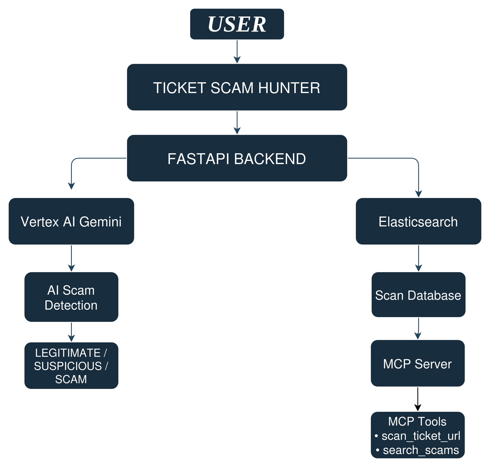

# ProTick AI

Ticket Scam Hunter is an AI-powered platform designed to identify potentially fraudulent ticket-selling websites, with a focus on FIFA World Cup 2026 ticket scams.

The project combines Google Vertex AI Gemini, FastAPI, Elasticsearch, and Model Context Protocol (MCP) to analyze ticket websites, classify risk levels, and provide searchable scam intelligence.

## Problem Statement

Major sporting events attract large numbers of fraudulent ticket websites and unauthorized resellers. Users often struggle to determine whether a ticket platform is trustworthy, resulting in financial loss and exposure to scams.

Ticket Scam Hunter helps users evaluate ticket websites by automatically analyzing website content and identifying potential scam indicators.

## Solution

Users submit a ticket website URL to the system.

The application:

* Retrieves and analyzes website information
* Uses Vertex AI Gemini to assess scam risk
* Classifies websites as Legitimate, Suspicious, or Scam
* Stores scan results in Elasticsearch
* Exposes analysis capabilities through MCP tools

## Architecture



### Workflow

1. A user submits a ticket website URL.
2. The FastAPI backend processes the request.
3. Website information is analyzed using Vertex AI Gemini.
4. A risk verdict is generated.
5. Results are stored in Elasticsearch.
6. MCP tools provide access to analysis and historical scan data.

## Features

* AI-powered ticket website analysis
* Scam detection using Vertex AI Gemini
* Elasticsearch-backed scan history
* MCP integration for agent-based workflows
* Searchable scam intelligence database
* Structured handling of DNS failures, SSL errors, timeouts, and HTTP errors

## Technology Stack

### Backend

* FastAPI
* Python 3

### Artificial Intelligence

* Google Vertex AI
* Gemini

### Data Storage

* Elasticsearch

### Agent Integration

* Model Context Protocol (MCP)

### Testing

* unittest

## MCP Tools

### scan_ticket_url

Analyzes a ticket website URL and returns a scam assessment.

### search_scams

Searches previously analyzed websites stored in Elasticsearch.

## Installation

### Clone the repository

```bash
git clone <repository-url>
cd scam-hunter-project
```

### Create a virtual environment

```bash
python3 -m venv .venv
source .venv/bin/activate
```

### Install dependencies

```bash
pip install -r requirements.txt
```

### Configure environment variables

Create a `.env` file:

```env
VERTEX_PROJECT=your-project-id
VERTEX_LOCATION=your-region
ES_API_KEY=your-elasticsearch-api-key
```

### Start the application

```bash
uvicorn main:app --reload --port 8000
```

## Running Tests

```bash
python -m unittest discover -s tests -v
```

Current test status:

```text
Ran 3 tests

OK
```

## Example Use Cases

* Verifying the legitimacy of ticket-selling websites
* Identifying unofficial ticket marketplaces
* Building AI agents that consume scam intelligence through MCP
* Maintaining a searchable repository of analyzed websites

## Future Improvements

* Domain reputation analysis
* WHOIS and DNS intelligence
* Browser-based analysis for JavaScript-heavy websites
* Real-time monitoring dashboard
* Support for additional events and ticketing platforms

## Google Cloud Services Used

* Vertex AI
* Gemini

## Project Status

The application includes:

* Functional FastAPI backend
* Vertex AI Gemini integration
* Elasticsearch integration
* MCP server implementation
* Automated unit tests
* Structured error handling for network and website access failures
